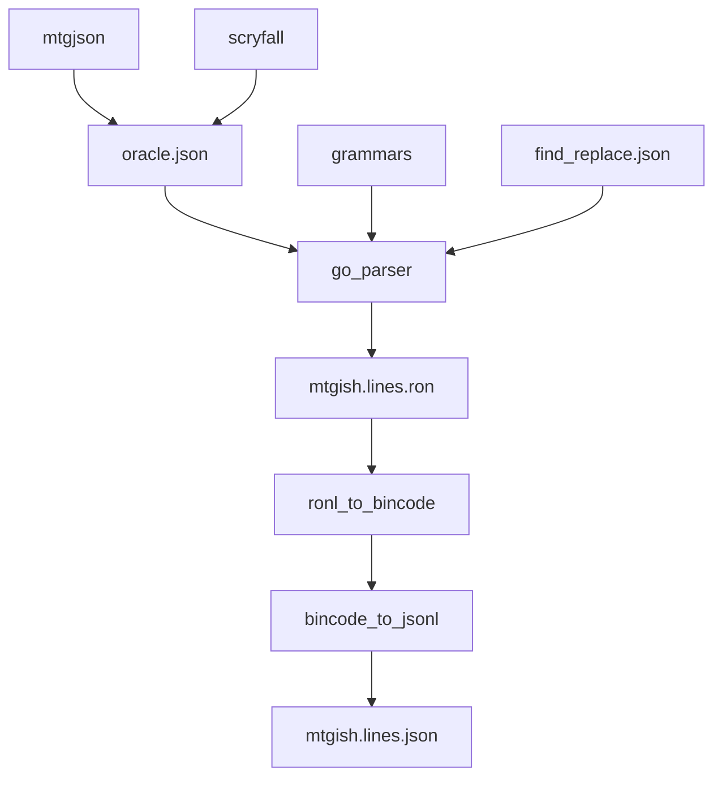

# mtgish (card parser + card representation)

``mtgish`` (pronounced emm-tee-gee-ish, rhymes with english) is an alternate syntax to represent Magic: the Gathering cards, designed for rules engines and AI. The parser itself converts english rules text into mtgish rules text.

As a quick example, the card [Shivan Dragon](https://scryfall.com/card/fdn/763/shivan-dragon) in plain text is:

```text
Shivan Dragon
Creature - Dragon
{4}{R}{R}
Flying
{R}: This creature gets +1/+0 until end of turn.
5/5
```

After parsing, the mtgish output is:

```rust
Card(
  Name: "Shivan Dragon",
  Typeline: (Supertypes: [], Cardtypes: [Creature], Subtypes: [Dragon],),
  ManaCost: [ManaCostGeneric(4), ManaCostR, ManaCostR],
  Rules: [
    Flying,
    Activated(
      PayMana([ManaCostR]),
      ActionList([
        CreatePermanentLayerEffectUntil(
          ThisPermanent,
          [AdjustPT(1, 0)],
          UntilEndOfTurn)]))],
  CardPT: (Power: 5, Toughness: 5))
```

This repository comes pre-built, and the output data files you care about are likely under ``/data/mtgish.lines.ron`` and ``rust_syntax/src/mtg_types.rs``, or, ``/data/mtgish.lines.json`` and ``/typescript_types/oracle_cards.d.ts``.

You can see a demo of this in action at [ https://card-parser-1.surge.sh/ ]. The demo may take a few minutes to load. Once it does, type in a card name in the text box and then select it from the list.


mtgish is similar to [forge script](https://github.com/Card-Forge/forge/wiki/Card-scripting-API), [wagic cardcode](https://github.com/WagicProject/wagic/wiki/CardCode), or the [LISP-y format used](https://news.ycombinator.com/item?id=40224115) by the official Wizards [Arena](https://magic.wizards.com/en/news/mtg-arena/on-whiteboards-naps-and-living-breakthrough) client.

## The Goals

### AI Research

This project was inspired by the decades of work that made [AlphaGo](https://deepmind.google/research/alphago/) possible.

First, Go needed an unambiguous ruleset that was more easily handled by computer program. The [Tromp/Taylor Rules of Go](https://www.cs.cmu.edu/~wjh/go/tmp/rules/TrompTaylor.html) did this, along with [a 100 line Haskell program](https://tromp.github.io/go/SimpleGo.hs.txt) implementing those rules.

Second, there needed to be a way to store and play back games. [SGF (the Smart Game Format)](https://en.wikipedia.org/wiki/Smart_Game_Format) was the Go format of choice.

Third, online servers for players to play against each other and collect training data were needed. I have fond memories of playing on [KGS](https://en.wikipedia.org/wiki/KGS_Go_Server), but there are many others.

Fourth, a place for AI program to play each other, such as the [Computer Go Server](http://www.yss-aya.com/cgos/19x19/standings.html).

I'm hoping this project can lay the same groundwork needed to advance Magic AI, starting with an unambiguous card representation format and a documenting of the rules.

### Rules Engine Development

Many people may want to implement their own Rules Engine, for self play, a weekend project, or for AI, but the sheer number of cards (over 32,000 at the time of this README) is a huge hurdle to overcome. No one wants to use a rules engine that doesn't have all of their favorite cards or interactions.

By providing a common card format, people can work on interpreting mtgish, and once that works, they have the entire card library at their disposable.

Documenting the rules and providing test cases also lowers the barrier to entry.

## The Technology

I jokingly refer to the parser as a really fancy find-and-replace feature, or as a reverse template system. The parsing rules look similar to [mustache templates](https://en.wikipedia.org/wiki/Mustache_%28template_system%29), and every string match (the find) has a string output (the replace).

```json
"{{Action}}": {
  "Draw {{Number}} cards":
    "DrawNumberCards({{Number[0]}})",
  "You gain {{Digits}} life, and each opponent loses {{Digits}} life":
    "GainLife({{Digits[0]}}), EachPlayerAction(Opponent, LoseLife({{Digits[1]}}))"
},
"{{Number}}": {
  "two": "2",
  "three": "3"
}
"{{Digits}}": {
  "1": "1",
  "2": "2",
  "3": "3"
}
```

If you feed the above grammar the text ``Draw two cards``, and the starting rule ``{{Action}}``, it will output ``DrawNumberCards(2)``.

You could play an interesting game of "Magic [Mad-Libs](https://en.wikipedia.org/wiki/Mad_Libs)" using these templates.

> Q: "Give me a permanent descriptor!"
>
> A: "Uhh... 'Zombies that attacked this turn'"
>
> Q: "Give me a keyword ability!"
>
> A: "Uhhh... 'Evolve'!"
>
> Q: "Zombies that attacked this turn have Evolve"!

The parser itself uses recursive [prefix trees (tries)](https://en.wikipedia.org/wiki/Trie), and requires matches to be unique.

If you have the grammar rules:

```json
"{{Action}}": {
  "Draw {{Number}} cards": "DrawNumberCards({{Number[0]}})",
  "Draw three cards":      "DrawNumberCards(3)"
},
"{{Number}}": {
  "two": "2",
  "three": "3"
}
```

and feed it the text ``Draw three cards``, the parser would complain that both ``Draw {{Number}} cards`` and ``Draw three cards`` match the same text.

Some match rules I wanted to make generic, such as certain game numbers. For example, [Divine Offering](https://scryfall.com/card/mbs/5/divine-offering) has "Destroy target artifact. You gain life equal to its mana value.", where the "it" in "it's mana value" is referring to the target permenent, compared to [Brainstealer Dragon](https://scryfall.com/card/otc/127/brainstealer-dragon) which has "Whenever a nonland permanent an opponent owns enters the battlefield under your control, they lose life equal to its mana value", where the "it" in "it's mana value" is referring to the permanent that caused the trigger.

I modified the grammar to allow passing in arguments:

```json
"{{Condition(ThatPermanent)}}": {
  "its mana value": "ManaValueOfPermanent({{ThatPermanent}})",
}
```

Divine Offering would call it with ``{{Condition(ThatPermanent=Ref_TargetPermanent)}}``, while Brainstealer Dragon would call it with ``{{Condition(ThatPermanent=Trigger_ThatPermanent)}}``.

I go back and forth if this was a good idea or not. The generic-ness is nice in some places, and more confusing than they should be in others. In general, back references such as "it", "that creature", "that card", etc were difficult and tedious to parse correctly, and I don't know if there is a good solution aside from elbow grease and spelling things out directly.

The full data flow from input to final output is:



Internal to the go_parser, the oracle json structure is cleaned up using some basic regex rules and the card typo fixes in ``find_replace.json``. The grammar is updated with rules specific to that card, so that ``CARD_NAME`` will match. Some card use nicknames, such as "Karn Liberated" being referred to as just "Karn". Those nicknames are also customized if avaiable.

## Current Limitations

I was inventing mtgish and learning the nuances of some of the Magic rules as I went along. A good portion of the actions I created may not be as clean as it could be. As time goes by and as I document and implement my own rules engine, this should get better.

I did not bother parsing "silly" cards from Un-sets and special events. The full ignore list is viewable under ``grammars/ignore.json5``.

## The License

I don't know. Talk with a lawyer. I'd like as much of the project to be under MIT as possible.

I don't think the data files themselves are copyright-able.

### Obligatory Wizards disclaimer

From: [Wizard's Fan Content Policy](https://company.wizards.com/fancontentpolicy)

This project is not affiliated with, endorsed, sponsored, or specifically
approved by Wizards of the Coast LLC.

Portions of this project are unofficial Fan Content permitted under the
Wizards of the Coast Fan Content Policy. The card names, Oracle text, and
some rules description presented on this website are copyright Wizards of
the Coast, LLC, a subsidiary of Hasbro, Inc.

### go jsonc license (used by the go parser)

From: [jsonc](https://github.com/tidwall/jsonc)

MIT License

Copyright (c) 2021 Josh Baker

Permission is hereby granted, free of charge, to any person obtaining a copy of
this software and associated documentation files (the "Software"), to deal in
the Software without restriction, including without limitation the rights to
use, copy, modify, merge, publish, distribute, sublicense, and/or sell copies of
the Software, and to permit persons to whom the Software is furnished to do so,
subject to the following conditions:

The above copyright notice and this permission notice shall be included in all
copies or substantial portions of the Software.

THE SOFTWARE IS PROVIDED "AS IS", WITHOUT WARRANTY OF ANY KIND, EXPRESS OR
IMPLIED, INCLUDING BUT NOT LIMITED TO THE WARRANTIES OF MERCHANTABILITY, FITNESS
FOR A PARTICULAR PURPOSE AND NONINFRINGEMENT. IN NO EVENT SHALL THE AUTHORS OR
COPYRIGHT HOLDERS BE LIABLE FOR ANY CLAIM, DAMAGES OR OTHER LIABILITY, WHETHER
IN AN ACTION OF CONTRACT, TORT OR OTHERWISE, ARISING FROM, OUT OF OR IN
CONNECTION WITH THE SOFTWARE OR THE USE OR OTHER DEALINGS IN THE SOFTWARE.

### json5 parser (used by the web demo)

From: [json5](https://github.com/json5/json5)

MIT License

Copyright (c) 2012-2018 Aseem Kishore, and [others].

Permission is hereby granted, free of charge, to any person obtaining a copy
of this software and associated documentation files (the "Software"), to deal
in the Software without restriction, including without limitation the rights
to use, copy, modify, merge, publish, distribute, sublicense, and/or sell
copies of the Software, and to permit persons to whom the Software is
furnished to do so, subject to the following conditions:

The above copyright notice and this permission notice shall be included in all
copies or substantial portions of the Software.

THE SOFTWARE IS PROVIDED "AS IS", WITHOUT WARRANTY OF ANY KIND, EXPRESS OR
IMPLIED, INCLUDING BUT NOT LIMITED TO THE WARRANTIES OF MERCHANTABILITY,
FITNESS FOR A PARTICULAR PURPOSE AND NONINFRINGEMENT. IN NO EVENT SHALL THE
AUTHORS OR COPYRIGHT HOLDERS BE LIABLE FOR ANY CLAIM, DAMAGES OR OTHER
LIABILITY, WHETHER IN AN ACTION OF CONTRACT, TORT OR OTHERWISE, ARISING FROM,
OUT OF OR IN CONNECTION WITH THE SOFTWARE OR THE USE OR OTHER DEALINGS IN THE
SOFTWARE.

### fuzzy sort (used by the web demo)

From: [fuzzysort](https://github.com/farzher/fuzzysort)

MIT License

Copyright (c) 2018 Stephen Kamenar

Permission is hereby granted, free of charge, to any person obtaining a copy
of this software and associated documentation files (the "Software"), to deal
in the Software without restriction, including without limitation the rights
to use, copy, modify, merge, publish, distribute, sublicense, and/or sell
copies of the Software, and to permit persons to whom the Software is
furnished to do so, subject to the following conditions:

The above copyright notice and this permission notice shall be included in all
copies or substantial portions of the Software.

THE SOFTWARE IS PROVIDED "AS IS", WITHOUT WARRANTY OF ANY KIND, EXPRESS OR
IMPLIED, INCLUDING BUT NOT LIMITED TO THE WARRANTIES OF MERCHANTABILITY,
FITNESS FOR A PARTICULAR PURPOSE AND NONINFRINGEMENT. IN NO EVENT SHALL THE
AUTHORS OR COPYRIGHT HOLDERS BE LIABLE FOR ANY CLAIM, DAMAGES OR OTHER
LIABILITY, WHETHER IN AN ACTION OF CONTRACT, TORT OR OTHERWISE, ARISING FROM,
OUT OF OR IN CONNECTION WITH THE SOFTWARE OR THE USE OR OTHER DEALINGS IN THE
SOFTWARE.

### Anything else

MIT License

Copyright (c) 2018 - 2026 mtgish team

Permission is hereby granted, free of charge, to any person obtaining a copy of
this software and associated documentation files (the "Software"), to deal in
the Software without restriction, including without limitation the rights to
use, copy, modify, merge, publish, distribute, sublicense, and/or sell copies of
the Software, and to permit persons to whom the Software is furnished to do so,
subject to the following conditions:

The above copyright notice and this permission notice shall be included in all
copies or substantial portions of the Software.

THE SOFTWARE IS PROVIDED "AS IS", WITHOUT WARRANTY OF ANY KIND, EXPRESS OR
IMPLIED, INCLUDING BUT NOT LIMITED TO THE WARRANTIES OF MERCHANTABILITY, FITNESS
FOR A PARTICULAR PURPOSE AND NONINFRINGEMENT. IN NO EVENT SHALL THE AUTHORS OR
COPYRIGHT HOLDERS BE LIABLE FOR ANY CLAIM, DAMAGES OR OTHER LIABILITY, WHETHER
IN AN ACTION OF CONTRACT, TORT OR OTHERWISE, ARISING FROM, OUT OF OR IN
CONNECTION WITH THE SOFTWARE OR THE USE OR OTHER DEALINGS IN THE SOFTWARE.
