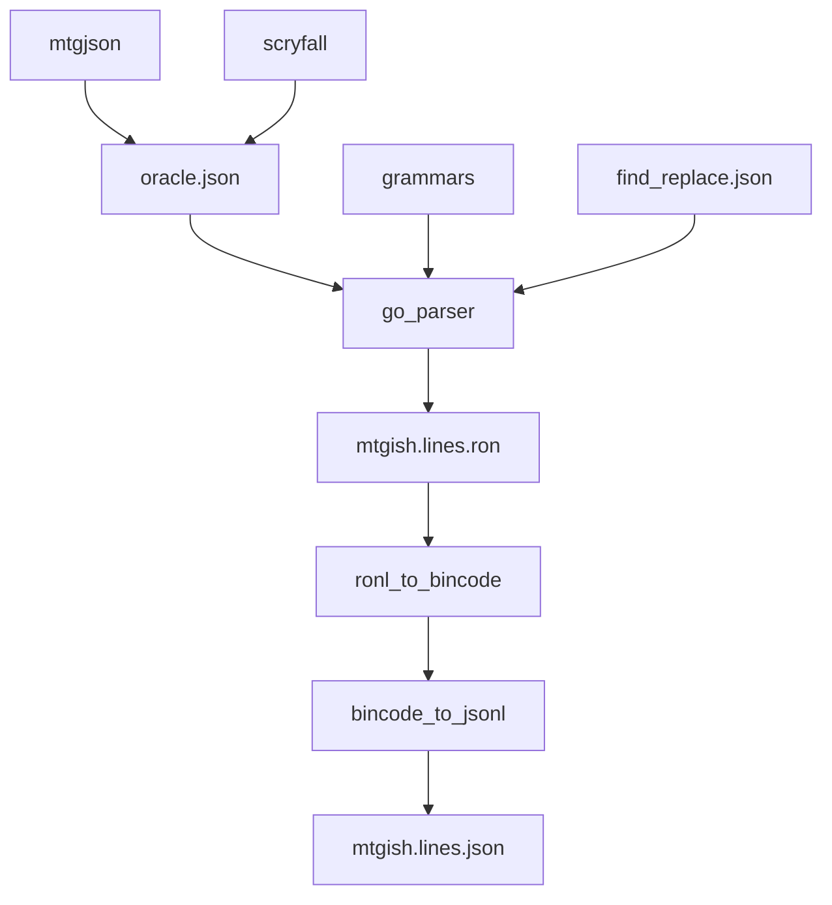

# mtgish (card parser + card representation)

``mtgish`` (pronounced emm-tee-gee-ish, rhymes with english) is an alternate syntax to represent Magic: the Gathering cards, designed for rules engines and AI. The parser itself converts english rules text into mtgish rules text.

As a quick example, the card [Shivan Dragon](https://scryfall.com/card/fdn/763/shivan-dragon) in plain text is:

```text
Shivan Dragon
Creature - Dragon
{4}{R}{R}
Flying
{R}: This creature gets +1/+0 until end of turn.
5/5
```

After parsing, the mtgish output is:

```rust
Card(
  Name: "Shivan Dragon",
  Typeline: (Supertypes: [], Cardtypes: [Creature], Subtypes: [Dragon],),
  ManaCost: [ManaCostGeneric(4), ManaCostR, ManaCostR],
  Rules: [
    Flying,
    Activated(
      PayMana([ManaCostR]),
      ActionList([
        CreatePermanentLayerEffectUntil(
          ThisPermanent,
          [AdjustPT(1, 0)],
          UntilEndOfTurn)]))],
  CardPT: (Power: 5, Toughness: 5))
```

This repository comes pre-built, and the output data files you care about are likely under ``/data/mtgish.lines.ron`` and ``rust_syntax/src/mtg_types.rs`` (for Rust), or, ``/data/mtgish.lines.json`` and ``/typescript_types/oracle_cards.d.ts`` (any JSON reader).

If you'd like to extend it, see [Development](#development).

You can see a demo of this in action at [ https://card-parser-1.surge.sh/ ]. The demo may take a few minutes to load. Once it does, type in a card name in the text box and then select it from the list.


mtgish is similar to [forge script](https://github.com/Card-Forge/forge/wiki/Card-scripting-API), [wagic cardcode](https://github.com/WagicProject/wagic/wiki/CardCode), or the [LISP-y format used](https://news.ycombinator.com/item?id=40224115) by the official Wizards [Arena](https://magic.wizards.com/en/news/mtg-arena/on-whiteboards-naps-and-living-breakthrough) client.

# Table of Contents

* [The Goals](#the-goals)
  * [AI Research](#ai-research)
  * [Rules Engine Development](#rules-engine-development)
* [The Technology](#the-technology)
* [Current Limitations](#current-limitations)
* [Development](#development)
* [Licenses](#licenses)
  * [Obligatory Wizards disclaimer](#obligatory-wizards-disclaimer)
  * [go jsonc license (used by the go parser)](#go-jsonc-license-used-by-the-go-parser)
  * [json5 parser (used by the web demo)](#json5-parser-used-by-the-web-demo)
  * [fuzzy sort (used by the web demo)](#fuzzy-sort-used-by-the-web-demo)
  * [Anything else](#anything-else)

# The Goals

## AI Research

This project was inspired by the decades of work that made [AlphaGo](https://deepmind.google/research/alphago/) possible.

First, Go needed an unambiguous ruleset that was more easily handled by computer program. The [Tromp/Taylor Rules of Go](https://www.cs.cmu.edu/~wjh/go/tmp/rules/TrompTaylor.html) did this, along with [a 100 line Haskell program](https://tromp.github.io/go/SimpleGo.hs.txt) implementing those rules.

Second, there needed to be a way to store and play back games. [SGF (the Smart Game Format)](https://en.wikipedia.org/wiki/Smart_Game_Format) was the Go format of choice.

Third, online servers for players to play against each other and collect training data were needed. I have fond memories of playing on [KGS](https://en.wikipedia.org/wiki/KGS_Go_Server), but there are many others.

Fourth, a place for AI program to play each other, such as the [Computer Go Server](http://www.yss-aya.com/cgos/19x19/standings.html).

I'm hoping this project can lay the same groundwork needed to advance Magic AI, starting with an unambiguous card representation format and a documenting of the rules.

## Rules Engine Development

Many people may want to implement their own Rules Engine, for self play, a weekend project, or for AI, but the sheer number of cards (over 32,000 at the time of this README) is a huge hurdle to overcome. No one wants to use a rules engine that doesn't have all of their favorite cards or interactions.

By providing a common card format, people can work on interpreting mtgish, and once that works, they have the entire card library at their disposable.

Documenting the rules and providing test cases also lowers the barrier to entry.

# The Technology

I jokingly refer to the parser as a really fancy find-and-replace feature, or as a reverse template system. The parsing rules look similar to [mustache templates](https://en.wikipedia.org/wiki/Mustache_%28template_system%29), and every string match (the find) has a string output (the replace).

```json
"{{Action}}": {
  "Draw {{Number}} cards":
    "DrawNumberCards({{Number[0]}})",
  "You gain {{Digits}} life, and each opponent loses {{Digits}} life":
    "GainLife({{Digits[0]}}), EachPlayerAction(Opponent, LoseLife({{Digits[1]}}))"
},
"{{Number}}": {
  "two": "2",
  "three": "3"
}
"{{Digits}}": {
  "1": "1",
  "2": "2",
  "3": "3"
}
```

If you feed the above grammar the text ``Draw two cards``, and the starting rule ``{{Action}}``, it will output ``DrawNumberCards(2)``.

You could play an interesting game of "Magic [Mad-Libs](https://en.wikipedia.org/wiki/Mad_Libs)" using these templates.

> Q: "Give me a permanent descriptor!"
>
> A: "Uhh... 'Zombies that attacked this turn'"
>
> Q: "Give me a keyword ability!"
>
> A: "Uhhh... 'Evolve'!"
>
> Q: "Zombies that attacked this turn have Evolve"!

The parser itself uses recursive [prefix trees (tries)](https://en.wikipedia.org/wiki/Trie), and requires matches to be unique.

If you have the grammar rules:

```json
"{{Action}}": {
  "Draw {{Number}} cards": "DrawNumberCards({{Number[0]}})",
  "Draw three cards":      "DrawNumberCards(3)"
},
"{{Number}}": {
  "two": "2",
  "three": "3"
}
```

and feed it the text ``Draw three cards``, the parser would complain that both ``Draw {{Number}} cards`` and ``Draw three cards`` match the same text.

Some match rules I wanted to make generic, such as certain game numbers. For example, [Divine Offering](https://scryfall.com/card/mbs/5/divine-offering) has "Destroy target artifact. You gain life equal to its mana value.", where the "it" in "it's mana value" is referring to the target permenent, compared to [Brainstealer Dragon](https://scryfall.com/card/otc/127/brainstealer-dragon) which has "Whenever a nonland permanent an opponent owns enters the battlefield under your control, they lose life equal to its mana value", where the "it" in "it's mana value" is referring to the permanent that caused the trigger.

I modified the grammar to allow passing in arguments:

```json
"{{Condition(ThatPermanent)}}": {
  "its mana value": "ManaValueOfPermanent({{ThatPermanent}})",
}
```

Divine Offering would call it with ``{{Condition(ThatPermanent=Ref_TargetPermanent)}}``, while Brainstealer Dragon would call it with ``{{Condition(ThatPermanent=Trigger_ThatPermanent)}}``.

I go back and forth if this was a good idea or not. The generic-ness is nice in some places, and more confusing than they should be in others. In general, back references such as "it", "that creature", "that card", etc were difficult and tedious to parse correctly, and I don't know if there is a good solution aside from elbow grease and spelling things out directly.

The full data flow from input to final output is:


```mermaid
flowchart TD
    mtgjson  --> oracle.json
    scryfall --> oracle.json
    oracle.json --> go_parser
    grammars --> go_parser
    find_replace.json --> go_parser
    go_parser --> mtgish.lines.ron
    mtgish.lines.ron --> ronl_to_bincode
    ronl_to_bincode --> bincode_to_jsonl
    bincode_to_jsonl --> mtgish.lines.json
```

Internal to the go_parser, the oracle json structure is cleaned up using some basic regex rules and the card typo fixes in ``find_replace.json``. The grammar is updated with rules specific to that card, so that ``CARD_NAME`` will match. Some card use nicknames, such as "Karn Liberated" being referred to as just "Karn". Those nicknames are also customized if avaiable.

# Current Limitations

I was inventing mtgish and learning the nuances of some of the Magic rules as I went along. A good portion of the actions I created may not be as clean as it could be. As time goes by and as I document and implement my own rules engine, this should get better.

I did not bother parsing "silly" cards from Un-sets and special events. The full ignore list is viewable under ``grammars/ignore.json5``.

# Development

This project uses [``just``](https://just.systems/) as a command runner.

The general development flow will be:

1. Download the latest card data (one time thing)
2. Check the english parsing process for any errors
   * Pull out the errors into a more manageable subset.
   * Debugging / fixing those parse errors
   * Repeat until no more errors
3. Clean up unused parsing rules
4. Check the ron parser process for any errors
   * Repeat until no more errors
5. Clean up unused rust types
6. Generate ``.json`` file

## Download the latest card data

Requirements: ``just``, ``curl``, ``python``

This step outputs ``data/oracle.json``, which is checked in and included in
the repo. I suggest using the checked in version, as it is guaranteed to not
have errors, unless you are in a hurry for new cards during spoiler season.

I try to keep it up to date, but am sometimes slow if I'm in the middle of a
different refactor.

```shell
$ just download_mtgjson
# - OR -
$ just download_scryfall
```

Both scripts *should* output the same data, depending on time of day, or if
spoiler season is in progress (scryfall updates 2x a day, mtgjson 1x a day).

The mtgjson data comes from their
[AtomicCards](https://mtgjson.com/downloads/all-files/#atomiccards) file.

The scryfall data comes from their
[OracleCards bulk data](https://scryfall.com/docs/api/bulk-data) files.

The files are downloaded to a temporary directory under ``/tmp/mtgish/``,
and then a cleanup script is ran over them to grab just the data that this
project cares about and format them nicely. The cleanup scripts are
``preprocess_mtgjson`` and ``preprocess_scryfall``. These preprocess script
may need to be updated if there are new card layouts (ex: Adventure, Prepare,
Flip, Transform, etc), or if some new "silly" cards are printed (ex: there
are two versions of *Red Herring*, a normal version for Murders at Karlov
Manor, and a silly playtest version for Mystery Booster Playtest Cards 2021).

The output file from the preprocess scripts is
``/tmp/mtgish/oracle_base.json``.

``oracle_base.json`` is merged with ``arena_cards.json`` from one of my other
projects, [mtga_to_scryfall](https://github.com/i5jb/mtga_to_scryfall).
Scryfall has / had issues keeping up with Arena changes. I'm hoping this merge
step can go away eventually. The final output from merging
``oracle_base.json`` and ``arena_cards.json`` is ``data/oracle.json``.

## Checking the grammar

Requirements: ``just``, ``go``

This step outputs ``data/mtgish.lines.ron``.

The primary card inputs come from ``data/oracle.json`` (from scryfall /
mtgjson), ``data/tokens.json`` (hand written by me based on the Magic
Comprehensive Rules), ``data/dungeons.json`` (manually grabbed by me from
the larger mtgjson and scryfall files, because they aren't included with
AtomicCards or OracleCards), and ``data/additional_cards.json`` (empty file
for other developers to put additional cards in).

``data/find_replace.json5`` is used to modify some of the primary card inputs
to fix typos or improve card wording when Wizards phrases something in a way
that I don't like.

``data/ignore.json5`` has a list of cards that are skipped over during
processing, either because they are in progress (spoiler season), or
are silly style cards. As a goal, I try not to upload any updates with in
progress cards.

The grammar inputs come from ``grammars/english_grammar*.json5`` and
``grammars/mtgish_grammar*.json5``.

Some additional grammar inputs are created using ``data/generate_plurals``
(python file), which manages the list of card types and sub types. This helps
keep things like elf (singular) and elves (plural) in a single location rather
than having to copy / paste them in multiple different places. When adding new
card types, this file will need to be edited.

The parsing source code lives under ``go_mtg_parser/``. It likely won't need
editing unless new card types are added, or if adding more debug information
for failing parses. If you are editing it, it can be recompiled using
``just parser_compile``.

Any of the parsing steps will always rebuild the ``go_mtg_parsr`` and re-run
``generate_plurals``, so you don't have to worry about running them manually.

The general process is:

1. Run ``just parser_check_grammar``
   * Look in ``/tmp/mtgish/grammar.failing.txt`` for errors
   * Add the broken cards to the list in ``data/debug.json5``
   * Run ``just parser_debug_subset`` to get better error messages.
   * Fix the ``grammars/*`` files until ``just parser_debug_subset`` gives
     no errors.
   * You can run ``just parser_debug_remaining | wc -l`` to show how
     many still need fixing if in the middle of a long run.
   * Re-run ``just parser_check_grammar`` to make sure you didn't break
     anything.
2. Run ``just parser_generate_mtgish``

### Example Card Addition - Part 1

We are going to add a new card, which purposely has several issues we'll
need to fix to show the different files that may need to be updated,
especially when adding new sets with new keywords, creature types, reminder
text, etc.

```
Teacher of the Coding Ways
{1}{W}{U}
Legendary Creature - Exemplar
When Teacher enters the battlefield, draw a card.
Other Exemplars you control get +1/+1.
At the beginning of combat on your turn, set an example. (To set
an example, reveal the top card of your library. If it's a creature
card, you may have all creature you control have base power and
toughness equal to that card's power and toughness.)
3/2
```

At a very high level, I know this card will roughly parse down to:

```
{{FullCardName}}
{{ManaCost}}
{{Typeline[Creature]}}
{{Line[Creature]}}
{{Line[Creature]}}
{{Line[Creature]}}
{{CardPT}}
```

It's tagged based on being a ``[Creature]``, so it won't be parsed as an
Instant or Sorcery Spell, and it's not an ``[Equipment]``, so it won't be
allowed to have a line like ``Equip {2}``. This is small safety check to
ensure that Wizards or you aren't doing anything too strange.

In the odd cases where you do need to color outside the lines of what the
typeline suggests, you'll need to make a more specialized template.

We'll add this to ``data/additional_cards.json``, and will base it on *Air
Elemental* from ``data/oracle_cards.json``.

```json
  {
    "name": "Air Elemental",
    "layout": "single",
    "cards": [
      {
        "name": "Air Elemental",
        "manaCost": "{3}{U}{U}",
        "type": "Creature — Elemental",
        "text": "Flying",
        "power": "4",
        "toughness": "4"
      }
    ]
  },
```

Filling in the details of *Teacher of the Coding Ways*, we have:

```json
  {
    "name": "Teacher of the Coding Ways",
    "layout": "single",
    "cards": [
      {
        "name": "Teacher of the Coding Ways",
        "manaCost": "{1}{W}{U}",
        "type": "Legendary Creature - Exemplar",
        "text": "When Teacher enters the battlefield, draw a card.\nOther Exemplars you control get +1/+1.\nAt the beginning of combat on your turn, set an example. (To set an example, reveal the top card of your library. If it's a creature card, you may have all creature you control have base power and toughness equal to that card's power and toughness.)",
        "power": "3",
        "toughness": "2"
      }
    ]
  }
```

Now we will try a full grammar compile using ``just parser_check_grammar``
This checks all cards, and may take a couple of minutes, and may take a few
extra seconds if compiling the go parser for the first time.

```bash
$ just parser_check_grammar
```

That command is silent, but outputs a log file to
``/tmp/mtgish/grammar.failing.txt``. If you check it, there should be one
line:

```
FAIL Teacher of the Coding Ways | Teacher of the Coding Ways@Legendary Creature - ...
```

If you are checking it after a big spoiler update, you can sometimes have
hundreds of cards in it.

I copy the entire list into ``data/debug.json5``, and grab the values between
``FAIL `` and `` | ``, put quotation marks around it, and can then begin the
debug process.

If you follow these steps, ``data/debug.json5`` should look like:

```json
[
  "Teacher of the Coding Ways",
]
```

Now, instead of typing ``just parser_check_grammar`` and having to wait a
few minutes, you can type ``just parser_debug_subset``. It will try to
parse the card as far as it can get, and show you where it got stuck.

At this point, it will look like:

```bash
$ just parser_debug_subset
```

```
FAIL Teacher of the Coding Ways | ...
No match
Teacher of the Coding Ways@Legendary Creature - Exemplar@...

Teacher of the Coding Ways
Legendary Creature - Exemplar
{1}{W}{U}
When Teacher enters the battlefield, draw a card.
Other Exemplars you control get +1/+1.
At the beginning of combat on your turn, set an example. (To set an example, reveal the top card of your library. If it's a creature card, you may have all creature you control have base power and toughness equal to that card's power and toughness.)
3/2

Best token match: 16
Teacher of the Coding Ways
Legendary Creature -
```

It will show the same error from ``/tmp/mtgish/grammar.failing.txt`` on the
first line, ``No match`` on the second line. The input text on the next line
in a weird single line format with ``@`` instead of new lines. This is
sometimes useful if counting characters, or if there's an extra space at the
end of a line that isn't as visible in the normal view. I didn't use ``\n``
because that would mess up the character count. Then it shows the input with
normal line characters. Finally, it shows the best match that it can get to.

In this case, it gets stuck after the `` - `` in the type line, and can't seem
to parse the word ``Exemplar``. This is a new *example* creature type I
created, and that will need to be added.

Creature types (and other card types and subtypes) are managed in
``grammars/generate_plurals``. Open that file up, and we'll add the new
creature type.

```python
  # Singular           Plural              Variable Name
  ("Eternal"        , "Eternals"        , "Eternal"       ),
  ("Exemplar"       , "Exemplars"       , "Exemplar"      ), # <-- ADD THIS
  ("Eye"            , "Eyes"            , "Eye"           ),
```

The first column is the creature type as a singular ("Elf"), the second is
plural ("Elves"), and the third is the type as a variable name (remove spaces
and punctuation, for things like ``"Time Lord"`` -> ``"TimeLord"``, or
``"C'Tan"`` -> ``"CTan"``). The variable name should normally match the
singular unless it's one of the above exceptions. It needs to be a safe
variable name in a programming language like Rust or Python.

After the above change, we run ``just parser_debug_subset`` again and get:

```
Best token match: 26
Teacher of the Coding Ways
Legendary Creature - Exemplar
{1}{W}{U}
When Teacher
```

So it appears to be stuck after the word ``Teacher`` and before the phrase
``enters the battlefield, ...``. In this case, it's an issue with using a
short nickname ("Teacher") vs. the full card name ("Teacher of the Coding
Ways"). Some short names the parser auto-figures out, like "Ajani, Caller of
the Pride" being shortened to ``Ajani``. I refer to these as *comma-names*.
But shortened names like "Teacher" have to be added manually. These manual
short names are stored in ``grammars/short_names.json5``. We'll modify it to
add:

```json
  // NAME of the VALUE
  "Ruhan of the Fomori"            : "Ruhan"         ,
  "Teacher of the Coding Ways"     : "Teacher"       , // <-- ADD THIS
  "Teysa of the Ghost Council"     : "Teysa"         ,
```

After the above change, we run ``just parser_debug_subset`` again and get:

```
Best token match: 28
Teacher of the Coding Ways
Legendary Creature - Exemplar
{1}{W}{U}
When Teacher enters
```

It seems someone missed the big Wizards update changing all of the "When
CARDNAME enters the battlefield, ..." triggers to be worded like "When
CARDNAME enters, ...". This is an annoying phrasing that we'd like to fix.
We could easily go in an fix the phrasing in ``additional_cards.json``, but
if the typo is coming direct from Wizards, we'd just have to live with it.
Fortunately, there's a file of with typo fixes,
``grammars/find_replace.json5``. Let's open that and add:

```json
  // ADD THIS
  {
    "reason":  "Missed the 'entering the battlefield' update",
    "cards":   ["Teacher of the Coding Ways"],
    "find":    "Teacher enters the battlefield, draw",
    "replace": "Teacher enters, draw",
  },
```

I try to give the find / replace text enough context so it doesn't accidentally
pull in other cards. ``"reason"`` and ``"cards"`` aren't strict or check, but
used to help when debugging or finding the patch if it later gets fixed.

After the above change, we run ``just parser_debug_subset`` again and get:

```
Best token match: 70
Teacher of the Coding Ways
Legendary Creature - Exemplar
{1}{W}{U}
When Teacher enters, draw a card.
Other Exemplars you control get +1/+1.
At the beginning of combat on your turn,
```

The parser doesn't seem to know what "set an example" is, since it's a new
Magic action I just invented.

Most triggers are listed under ``"{{TriggerEffect}}"`` (doesn't use the card
name in the trigger) and ``"{{TriggerEffect(~Permanent)}}`` (does use the card
name in the trigger). And of those, there are the 'easy' triggers, that use
generic actions like "target creatures gets +1/+1 until end of turn" or "draw
a card", and there are 'hard' triggers that use the word 'it' or 'that
creature', like "Whenever a creature you control attacks, it gets +1/+1 until
end of turn". I prefer to parse hard triggers as a single line, so that
example would get a template like 
``Whenever {{a}} {{Permanent}} attacks, it gets {{PTMod}} until end of turn``.
The easier triggers can be more generic,
``At the beginning of combat on your turn, {{TriggerActions}}``.

"set an example" is an 'easy' trigger, so I want to add a new template to the
generic ``"{{TriggerActions}}"`` list. Open up
``grammars/english_grammar.json5``, find ``"{{TriggerActions}}"``, and near the
top, we'll add:

```json5
  "{{TriggerActions}}": {
    "set an example": "ActionList([SetAnExample])", // <-- ADD THIS
    ...
  }
```

I invented ``SetAnExample`` as a new mtgish keyword to handle this new keyword
action.

After the above change, we run ``just parser_debug_subset`` again and get:

```
Best token match: 80
Teacher of the Coding Ways
Legendary Creature - Exemplar
{1}{W}{U}
When Teacher enters, draw a card.
Other Exemplars you control get +1/+1.
At the beginning of combat on your turn, set an example. (To 
```

Now we're stuck in the middle of the reminder text for this new keyword. This
is brand new, so we'll need up update the reminder text list. I split them
out into it's own file ``grammars/english_grammar-reminder_text.json5``.

You can edit that file to add:

```json5
  "{{Reminder}}": {
    "(To set an example, reveal the top card of your library. If it's a creature card, you may have all creature you control have base power and toughness equal to that card's power and toughness.)": "",
    // ^--- ADD THAT
    ...
  },
```

I'll sometimes split out and organize ``{{Reminder}}``s a little better, and
the file could end up like the below instead:

```json5
  // v---- ADDED THIS WHOLE NEW STRUCTURE INSTEAD
  "{{Reminder[SetAnExample]}}": {
    "(To set an example, reveal the top card of your library. If it's a creature card, you may have all creature you control have base power and toughness equal to that card's power and toughness.)": "",
  },
  "{{Reminder}}": {
    "{{Reminder[SetAnExample]}}": "",
    // ^--- ADDED THIS INDIRECTION INSTEAD
    ...
  },
```

Splitting things out is a taste thing.

Once you make one of those two changes, we'll run ``just parser_debug_subset``
again:

```
FAIL (No match): Teacher of the Coding Ways
Card(Name: "Teacher of the Coding Ways", Typeline: (Supertypes: [Legendary], Cardtypes: [Creature], Subtypes: [Exemplar]), ManaCost: [ManaCostGeneric(1), ManaCostW, ManaCostU], Rules: [TriggerA(WhenAPermanentEntersTheBattlefield(SinglePermanent(ThisPermanent)), ActionList([DrawACard])), EachPermanentLayerEffect(And([Other(ThisPermanent), And([IsCreatureType(Exemplar), ControlledByAPlayer(SinglePlayer(You))])]), [AdjustPT(+1, +1)]), TriggerA(AtTheBeginningOfCombatDuringAPlayersTurn(SinglePlayer(You)), ActionList([SetAnExample]))], CardPT: (Power: 3, Toughness: 2))
Teacher of the Coding Ways
Legendary Creature - Exemplar
{1}{W}{U}
When Teacher enters, draw a card.
Other Exemplars you control get +1/+1.
At the beginning of combat on your turn, set an example. (To set an example, reveal the top card of your library. If it's a creature card, you may have all creature you control have base power and toughness equal to that card's power and toughness.)
3/2
Best token match: 149
Card(Name: "Teacher of the Coding Ways", Typeline: (Supertypes: [Legendary], Cardtypes: [Creature], Subtypes: [Exemplar]), ManaCost: [ManaCostGeneric(1), ManaCostW, ManaCostU], Rules: [TriggerA(WhenAPermanentEntersTheBattlefield(SinglePermanent(ThisPermanent)), ActionList([DrawACard])), EachPermanentLayerEffect(And([Other(ThisPermanent), And([IsCreatureType(Exemplar), ControlledByAPlayer(SinglePlayer(You))])]), [AdjustPT(+1, +1)]), TriggerA(AtTheBeginningOfCombatDuringAPlayersTurn(SinglePlayer(You)), ActionList([
```

This looks a *lot* different from our previous attempts. We've finally made it
past parsing the English part of the card, and now we're checking the *mtgish*
output.

It's a similar process though, and if you look at the very end, it doesn't
seem to know what ``SetAnExample`` is, since it's a new kind of action, like
``DrawACard`` or ``Shuffle``.

These actions are stored in ``grammars/mtgish_grammar.json5`` (or possibly on
of the other ``mtgish_grammar-*.json5`` files). But at the time of writing,
the best place to put ``SetAnExample`` will be in ``mtgish_grammar.json5``.

So, we open it up, and add:

```json5
  "{{BASIC_PLAYER_ACTION}}": {
    "SetAnExample": "",
    ...
  },
```

Now, if we run ``just parser_debug_subset`` again, we'll hopefully get an all
clear (no output).

```bash
$ just parser_debug_subset
$
```

As a final check, I like to rerun ``parser_check_grammar`` to make sure I
didn't accidentally mess up any other cards in the process. We'll run that
again, and check that ``/tmp/mtgish/grammar.failing.txt`` is blank. If it is,
we're free to move on.

```bash
$ just parser_check_grammar
$ cat /tmp/mtgish/grammar.failing.txt
$
```

Once all of that is clean, we can generate the big ``data/mtgish.lines.ron``
file using ``just parser_generate_mtgish``.

```bash
$ just parser_generate_mtgish
$ git diff data/mtgish.lines.ron
# Hopefully a single new line in the diff, showing the new card
```

## Generating the json and type files

FIXME - Fill in more details here

### Example Card Addition - Part 2

FIXME - Fill in more details here

# Licenses

I don't know. Talk with a lawyer. I'd like as much of the project to be under MIT as possible.

I don't think the data files themselves are copyright-able.

## Obligatory Wizards disclaimer

From: [Wizard's Fan Content Policy](https://company.wizards.com/fancontentpolicy)

This project is not affiliated with, endorsed, sponsored, or specifically
approved by Wizards of the Coast LLC.

Portions of this project are unofficial Fan Content permitted under the
Wizards of the Coast Fan Content Policy. The card names, Oracle text, and
some rules description presented on this website are copyright Wizards of
the Coast, LLC, a subsidiary of Hasbro, Inc.

## go jsonc license (used by the go parser)

From: [jsonc](https://github.com/tidwall/jsonc)

MIT License

Copyright (c) 2021 Josh Baker

Permission is hereby granted, free of charge, to any person obtaining a copy of
this software and associated documentation files (the "Software"), to deal in
the Software without restriction, including without limitation the rights to
use, copy, modify, merge, publish, distribute, sublicense, and/or sell copies of
the Software, and to permit persons to whom the Software is furnished to do so,
subject to the following conditions:

The above copyright notice and this permission notice shall be included in all
copies or substantial portions of the Software.

THE SOFTWARE IS PROVIDED "AS IS", WITHOUT WARRANTY OF ANY KIND, EXPRESS OR
IMPLIED, INCLUDING BUT NOT LIMITED TO THE WARRANTIES OF MERCHANTABILITY, FITNESS
FOR A PARTICULAR PURPOSE AND NONINFRINGEMENT. IN NO EVENT SHALL THE AUTHORS OR
COPYRIGHT HOLDERS BE LIABLE FOR ANY CLAIM, DAMAGES OR OTHER LIABILITY, WHETHER
IN AN ACTION OF CONTRACT, TORT OR OTHERWISE, ARISING FROM, OUT OF OR IN
CONNECTION WITH THE SOFTWARE OR THE USE OR OTHER DEALINGS IN THE SOFTWARE.

## json5 parser (used by the web demo)

From: [json5](https://github.com/json5/json5)

MIT License

Copyright (c) 2012-2018 Aseem Kishore, and [others].

Permission is hereby granted, free of charge, to any person obtaining a copy
of this software and associated documentation files (the "Software"), to deal
in the Software without restriction, including without limitation the rights
to use, copy, modify, merge, publish, distribute, sublicense, and/or sell
copies of the Software, and to permit persons to whom the Software is
furnished to do so, subject to the following conditions:

The above copyright notice and this permission notice shall be included in all
copies or substantial portions of the Software.

THE SOFTWARE IS PROVIDED "AS IS", WITHOUT WARRANTY OF ANY KIND, EXPRESS OR
IMPLIED, INCLUDING BUT NOT LIMITED TO THE WARRANTIES OF MERCHANTABILITY,
FITNESS FOR A PARTICULAR PURPOSE AND NONINFRINGEMENT. IN NO EVENT SHALL THE
AUTHORS OR COPYRIGHT HOLDERS BE LIABLE FOR ANY CLAIM, DAMAGES OR OTHER
LIABILITY, WHETHER IN AN ACTION OF CONTRACT, TORT OR OTHERWISE, ARISING FROM,
OUT OF OR IN CONNECTION WITH THE SOFTWARE OR THE USE OR OTHER DEALINGS IN THE
SOFTWARE.

## fuzzy sort (used by the web demo)

From: [fuzzysort](https://github.com/farzher/fuzzysort)

MIT License

Copyright (c) 2018 Stephen Kamenar

Permission is hereby granted, free of charge, to any person obtaining a copy
of this software and associated documentation files (the "Software"), to deal
in the Software without restriction, including without limitation the rights
to use, copy, modify, merge, publish, distribute, sublicense, and/or sell
copies of the Software, and to permit persons to whom the Software is
furnished to do so, subject to the following conditions:

The above copyright notice and this permission notice shall be included in all
copies or substantial portions of the Software.

THE SOFTWARE IS PROVIDED "AS IS", WITHOUT WARRANTY OF ANY KIND, EXPRESS OR
IMPLIED, INCLUDING BUT NOT LIMITED TO THE WARRANTIES OF MERCHANTABILITY,
FITNESS FOR A PARTICULAR PURPOSE AND NONINFRINGEMENT. IN NO EVENT SHALL THE
AUTHORS OR COPYRIGHT HOLDERS BE LIABLE FOR ANY CLAIM, DAMAGES OR OTHER
LIABILITY, WHETHER IN AN ACTION OF CONTRACT, TORT OR OTHERWISE, ARISING FROM,
OUT OF OR IN CONNECTION WITH THE SOFTWARE OR THE USE OR OTHER DEALINGS IN THE
SOFTWARE.

## Anything else

MIT License

Copyright (c) 2018 - 2026 mtgish team

Permission is hereby granted, free of charge, to any person obtaining a copy of
this software and associated documentation files (the "Software"), to deal in
the Software without restriction, including without limitation the rights to
use, copy, modify, merge, publish, distribute, sublicense, and/or sell copies of
the Software, and to permit persons to whom the Software is furnished to do so,
subject to the following conditions:

The above copyright notice and this permission notice shall be included in all
copies or substantial portions of the Software.

THE SOFTWARE IS PROVIDED "AS IS", WITHOUT WARRANTY OF ANY KIND, EXPRESS OR
IMPLIED, INCLUDING BUT NOT LIMITED TO THE WARRANTIES OF MERCHANTABILITY, FITNESS
FOR A PARTICULAR PURPOSE AND NONINFRINGEMENT. IN NO EVENT SHALL THE AUTHORS OR
COPYRIGHT HOLDERS BE LIABLE FOR ANY CLAIM, DAMAGES OR OTHER LIABILITY, WHETHER
IN AN ACTION OF CONTRACT, TORT OR OTHERWISE, ARISING FROM, OUT OF OR IN
CONNECTION WITH THE SOFTWARE OR THE USE OR OTHER DEALINGS IN THE SOFTWARE.
